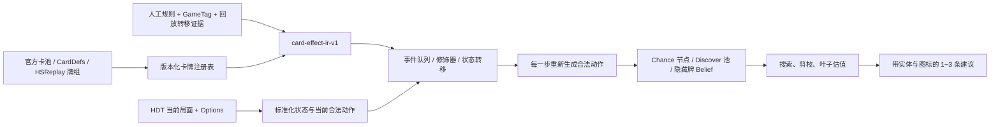

# 炉石卡牌效果建模：从“读懂文本”到可搜索的状态转移

## 结论先行

当前插件的问题不是缺少更多单卡权重，而是缺少一条完整的规则理解链：

> 卡牌与局面数据 → 结构化效果 IR → 事件队列与状态转移 → 每一步重新生成合法动作 → 随机/隐藏信息分支 → 搜索与排序 → 简洁可解释的 UI

强化学习不能替代这条链。规则层负责“这张卡到底做什么、现在还能做什么”；概率层负责“随机结果和对手未知牌有多大可能”；策略层才负责“几条合法路线中哪条更好”。玩家和对手的实战动作很有价值，但它们只能作为行为先验、对手模型和规则校验数据，不能直接视为最优标签。

本轮已经把当前官方 Standard 与 Arena 卡池的 1,811 张去重卡全部接入离线链路：`CardDefs/官方英文文本 → 语义分类 → 通用 IR → Rust 状态转移 → 自动测试`。其中 143 张已从完整文本编译成通用可执行规则，39 张已有严格规则，98 张是只依赖引擎内建语义的纯关键词牌；其余 1,531 张也都有触发、目标、操作、随机性、隐藏信息和建模阻塞项，不再是未知黑箱。文本编译产物一律标记为 `generic`，不会冒充严格规则或最优证明。

## 数据范围与证据

流派数据仍使用当前补丁、标准模式、钻石至传说的 Meta 总体前 20 个流派作为优先级语料；卡牌认识范围已经扩展到完整 Standard/Arena 官方池：

| 项目 | 当前结果 |
|---|---:|
| 前 20 流派环境占比 | 88.45% |
| Meta 样本场次 | 3,507,252 |
| HSReplay 牌组代码快照 | 257 套，2026-08-02 |
| 完整映射到当前 Standard 的有效牌组 | 77 套 |
| 有 Premium / Branch `CURRENT_PATCH` 核心证据的牌组 | 22 套 |
| 牌组—卡牌记录 | 1,344 条 |
| 唯一主流卡牌 | 300 张 |
| 官方 Standard 卡池 | 1,152 张 |
| 官方 Arena 卡池 | 1,131 张 |
| Standard/Arena 去重并集 | 1,811 张 |
| CardDefs build | 247416 |
| 完整文本通用编译规则 | 143 张 |
| 当前官方池内严格规则 | 39 张 |
| 纯关键词、无需文本状态转移 | 98 张 |
| 需要手工 IR | 441 张 |
| 已分类、待模板复核 | 1,090 张 |

牌组语料分两层：77 套有效牌组用于广义覆盖；其中 22 套具有当前补丁的强证据。被拒绝的牌组会保留原因和无法映射的 DBF ID，旧牌或坏数据不会混入当前卡池。

对应的可复现产物：

- `artifacts/card-modeling/current/mainstream-decks.json`
- `artifacts/card-modeling/current/mainstream-deck-cards.json`
- `artifacts/card-modeling/current/mainstream-cards.json`
- `artifacts/card-modeling/current/mainstream-card-semantics.json`
- `artifacts/card-modeling/current/semantic-summary.json`
- `artifacts/card-modeling/current/MAINSTREAM-CARD-CATALOG.md`

## 全卡池逐卡文本盘点结果

1,811 张卡全部进入版本化目录且 CardID 无重复。编译审计保留每张卡的规范化文本、文本 SHA-256、格式归属、编译状态、语义 IR 和明确阻塞原因；报告位于 `artifacts/card-modeling/official-current/card-text-compilation-report.json`。其中 143 张通用规则与 39 张严格规则可进入 Rust，98 张纯关键词牌由引擎内建语义处理；剩余 1,629 张尚未进入这一通用编译器，但全部完成语义索引。

全池高频效果族如下；一张卡可同时属于多个效果族：

| 效果族 | 卡牌数 |
|---|---:|
| 召唤 | 326 |
| 伤害 | 284 |
| 身材修改 | 220 |
| 抽牌 | 185 |
| 费用修改 | 156 |
| 生成卡牌 | 142 |
| 发现 | 117 |
| 嵌套施放 | 103 |
| 摧毁 | 80 |

此前的 300 张主流标准卡仍保留为开发优先级样本：151 张随从、132 张法术、8 张地标、8 张武器和 1 张英雄牌。下面这组细分统计描述该优先级样本，不代表全卡池边界。

### 当前能从文本稳定识别出的效果族

效果族可以重叠；一张卡通常包含多个操作。

| 操作 | 卡牌数 | 建模含义 |
|---|---:|---|
| 伤害 | 59 | 数值表达式、伤害来源、目标选择、法强、吸血、过量伤害 |
| 抽牌 | 40 | 区域移动、牌库顺序、疲劳、过牌条件 |
| 召唤 | 47 | Token 依赖、站位、满场、召唤后事件 |
| 身材修改 | 37 | 加法、设值、倍增、持续时间、沉默层 |
| 发现 | 38 | 候选池、抽样规则、玩家选择、后验信息 |
| 费用修改 | 29 | set/add/min/max 层、消耗时机、动态重算 |
| 生成卡牌 | 31 | 生成池、来源标记、手牌上限、历史标签 |
| 施放其他法术 | 16 | 嵌套结算、目标继承、递归保护、随机性传播 |
| 治疗 | 9 | 过量治疗、替代效果、治疗触发 |
| 摧毁 | 13 | 死亡队列、亡语、位置和复生 |

主要触发包括 132 张法术的打出结算、98 个战吼文本、29 个亡语文本、13 个回合结束触发、8 个地标激活，以及开局、回合开始、攻击后、施法后、持续光环和替代效果等。

### 主流优先级样本中不能靠“文本关键字 + 权重”解决的部分

| 风险 | 卡牌数 | 为什么需要独立模型 |
|---|---:|---|
| 随机或玩家选择 | 91 | 要生成 chance/choice 分支，不能压成一个平均分 |
| 隐藏信息或未知卡池 | 60 | 需要卡池版本、对手牌组后验和观测更新 |
| 历史依赖 | 70 | 必须维护本回合、上回合、整局、死亡和施放事件日志 |
| 动态/拼接展示文本 | 24 | CardDefs 文本含占位符、升级态或多个版本，不能直接编译 |
| 需要事件队列/持续状态/手工 IR | 131 | 涉及嵌套施放、替代效果、持续光环、规则修改或复杂池 |
| 可用通用模板表达但仍需复核 | 155 | 原子效果较清楚，但目标、顺序和边界必须验证 |
| 当时已有严格文本指纹与显式规则 | 14 | 这是旧主流快照口径，不是当前全池覆盖数 |

这里的“模板候选”不等于已经理解；它只表示可以通过少量通用操作模板编写，经人工审核和状态转移测试后再启用。

## 一个重要的数据边界：CardDefs 不是游戏脚本

补查 300 张卡的 HearthDb 数据后：

- 77 张卡带 `ReferencedTags`，能提示 `HERALD`、`IMBUE`、`DARK_GIFT`、`PREPARE` 等机制；
- 但 300 张卡的 `EntourageCardIds` 全部为空；
- 文本明确提到的衍生牌、Token、英雄技能或嵌套效果，并没有形成可靠、完整的实体依赖边。

因此不能假设“有 CardDefs 就有完整规则”。例如一张卡写着获得某个具名法术，CardDefs 仍可能不给出那个法术的 CardID；英雄技能、附魔、任务奖励和动态形态也未必是主牌组中的 300 张根卡。完整规则库需要从 1,152 张 Standard 卡池出发，再做 Token、英雄技能、附魔、任务奖励、形态和生成池的传递闭包。

## 推荐的三层模型

### 1. 规则层：确定“能做什么、会发生什么”

规则层必须是确定性的可审计状态机，包含：

- 当前实体、区域、法力、攻击次数、地标冷却/耐久、英雄技能使用次数；
- `Trigger → Condition → Selector → Operation → Duration`；
- 事件队列、死亡队列、同时结算、触发顺序和替代效果；
- 费用、攻击、生命、关键词和权限修饰器的分层；
- 每个动作或子效果结算后重新计算状态、光环和合法动作；
- 规则的文本指纹、补丁版本、人工审核状态与转移测试。

HDT `Options` 是“当前真实局面的合法动作真值”，尤其适合校验目标、地标点击和当前英雄技能状态；它不能单独提供搜索两三步后的未来合法动作，所以内部引擎仍要模拟状态转移。

### 2. 概率层：确定“未知结果有多大可能”

随机性不是一个额外权重，而是搜索树中的显式节点：

- 小型离散结果精确枚举；
- 随机分配伤害用动态规划合并同构结果；
- 大型生成池按当前补丁卡池过滤后分层采样；
- Discover 先生成候选三张，再建立玩家选择分支；
- 对手手牌用牌组流派先验、已见牌、抽牌/生成来源和未打出行为更新后验；
- 输出同时保留期望值、最坏合理分位数和关键风险，而不是只显示一个伪精确胜率。

### 3. 策略层：确定“哪条合法路线更好”

搜索、模仿学习或强化学习只在合法且可模拟的动作树上工作：

- 策略网络/行为数据用于动作排序和剪枝；
- 价值模型用于叶子估值；
- 对手行为用于 response policy；
- 规则层永远有否决权，学习模型不能凭概率创造动作或篡改卡牌效果。

这意味着不必先训练一个巨大 RL 模型才能让插件认识法术、武器、地标或条件光环。先把规则和事件语义建好，现有搜索就能立刻改善；RL 是后续提高速度和长期价值判断的工具。

### 当前已进入求解器的随机卡切片

`CATA_485`（激寒急流）已经不是报告中的待办项，而是正式进入共享规则包的可执行规则。共享规则包当前有 47 条审核规则、覆盖 205 个 CardID；其中落入这次 300 张主流卡快照的数量采用另一套统计口径，不能与全规则包覆盖数直接相加。

这张卡的结算被明确拆成两段：玩家先选择任意角色承受 2 点伤害，然后系统从仍存活、非休眠的敌方随从中均匀随机选择一个承受 1 点伤害。求解器不会把第二段误当成玩家指定目标，也不会把随机结果压成固定权重：

- Rust 使用精确分数生成、合并状态分支，并在 Chance 节点取概率期望；
- 我方动作节点取最大值，对手可见回应节点取最小值；
- 前一段若杀死唯一可用随机目标，后一段按真实规则落空；隐身随从仍属于随机池；
- 尼利造成的一费法术重复会按结算顺序继续展开概率树；
- UI 路线在真实随机结果发生处停止，收到 HDT 新状态后立即重算，不伪造后续确定操作；
- Python 参考实现使用独立状态转移和 `Fraction` 概率，用于交叉校验 Rust，而不是复读 Rust 输出。

这条链证明“审核后的卡牌可以直接加入求解器”。现在全部 1,811 张牌都会先经过批量文本分类和闭合语法编译；能完整表达目标、顺序与边界的文本直接生成 `generic` 规则，不能完整表达的牌保留明确阻塞项并 fail closed，不会被当作白板牌，也不会靠实战随机试错猜效果。

### 全环境随机/Discover 卡池库存

`card-generation-pools-v1.json` 现在对 Standard/Arena 1,811 张去重卡做全量扫描，登记 417 张包含随机或 Discover 的卡。库存不是一个“随机”布尔值，而是保存选择方式、结果去向、来源域和组合约束：例如“随机 8 费奥术法术”同时得到费用 `8..8`、类型 `SPELL`、派系 `ARCANE`；“发现猎人随从”得到 `MINION + HUNTER`；“史诗、稀有、普通各一张”则编译为三个按原文顺序结算的池效果。

当前 34 张审核规则已进入 Rust：候选从刚验证的当前 Standard/Arena 快照解析，小池精确枚举，大池最多保留确定性分层代表，权重仍对应原始池人口；多个随机效果的联合分支约束在约 96 个结果。过滤抽牌使用完整剩余牌库多重集和实际剩余副本数计算概率；完整牌库里没有符合条件的牌时，效果会确定性空过。其余 383 张仍保留在人工队列，主要难点是亡语/回合末等触发引擎、动态费用、专属衍生池、牌库或历史来源、嵌套随机施法与随机目标。它们不会被当前卡池替代，也不会因“文本看起来差不多”而执行。Discover 的候选选择目前还是牌面质量启发式，不是完整后续搜索的真正 Choice 节点。

## `card-effect-ir-v1` 的核心结构

Schema 位于 `solver/metacompanion_solver/rules_data/card-effect-ir-v1.schema.json`，三个已验证的示例位于同目录的 `card-effect-ir-v1.examples.json`。

每张卡由以下部分组成：

1. `text_fingerprint`：绑定语言、规范化文本、SHA-256 和 CardDefs build，补丁变更时自动失效。
2. `intrinsic`：费用、身材、耐久、种族、法术派系、关键词和打出限制。
3. `dependencies`：Token、附魔、英雄技能、生成池、具名卡和关键词规则。
4. `clauses`：一张卡可以有多个独立触发子句，每个子句含触发、条件、选择器绑定、按顺序执行的操作。
5. `resolution`：立即、事件队列、死亡队列、同时或顺序结算，以及是否每个子操作后重算合法性。
6. `randomness`：确定、玩家选择、均匀/加权随机、Discover、洗牌或 belief 加权未知。
7. `visibility`：读取公开/私有状态的范围，以及怎样更新隐藏信息后验。
8. `verification`：人工审核、文本匹配、前后状态 fixture 和实战转移证据。

统一 IR 的目标不是消灭卡牌差异，而是把差异组合成少量稳定原语。新卡通常只需组合现有 Trigger、Selector 和 Operation；真正改变游戏规则的少数卡才新增解释器能力。

## 对已观察问题的直接解释

### 手牌降到 3 张后英雄技能变为 0 费

`TIME_606` 不是“看到这张牌时给技能加分”，而是一个持续光环：当 `owner.hand.count <= 3` 时，在费用层把英雄技能设为 0。任何打牌、抽牌、弃牌或换手动作结算后，都必须重新评估光环并重新枚举动作。只有这样，搜索才能在“先打牌把手牌降到 3 → 再使用 0 费英雄技能”的同一条路线中看到后半步。

是否还能再次使用英雄技能是另一个独立状态：规则层必须同时检查本回合使用次数和刷新效果，不能从“费用变 0”推断“刷新使用次数”。

### 装备武器后没有攻击备选

装备武器应产生 `WEAPON_EQUIPPED` 和英雄攻击属性重算。结算后动作生成器要检查攻击力、已攻击次数、冻结、嘲讽和目标，新增具体的 `英雄 → 某实体` 攻击动作。UI 不应显示“指定 XX 攻击 XX”，而应携带源/目标实体 ID、名称和图标。

### 地标、法术和目标不明确

法术打出、地标放置、地标激活、随从攻击、英雄攻击和英雄技能都是不同的动作类型。Selector 必须保留控制方、区域、实体类型、过滤条件、目标数量和选择方式；最终建议直接引用 HDT 实体，而不是只输出一句无法执行的自然语言。

### 尼利应该先于 1 费法术

`TLC_836` 有两个事件触发：1 费随从入场后身材倍增，1 费法术声明施放后追加一次施放。只要事件队列和法术重复规则进入模拟器，搜索自然会比较“先尼利再 1 费法术”和反向顺序；不需要给尼利写一个永久最高优先级特判。多张尼利的叠加、目标继承和递归保护需要单独转移测试。

### 随机、Discover 与对手卡牌推测

这正是 AI 计算能力应该发挥的地方，但前提仍是规则正确。模型需要知道候选池和每个结果怎样改变局面，再用精确枚举、采样和 belief 更新计算路线价值；不能把“随机”简化为一个固定惩罚分。

## 实战行为数据怎样使用

当前记录“我做了什么、对手做了什么”有四类价值：

1. 规则验证：对比动作前后实体和 GameTag，确认 IR 的状态转移是否正确。
2. 动作先验：高水平样本帮助搜索先展开更可能的路线。
3. 对手模型：估计不同流派和局面下的回应概率。
4. 反事实评估：在规则引擎中重放当时局面，比较实际动作与其他合法动作。

但单场实际动作不是“最优出牌”标签。训练前必须保证动作边界、目标实体、前后状态和终局结果可连接；不完整的 HDT GameEvents 只能作为候选证据，不能强行训练。

## 推荐落地顺序

### 阶段 A：通用确定性原语

前两批已完成伤害、治疗、抽牌、护甲、召唤、身材修改、武器增攻、变形、明确目标选择、固定重复次数、固定费用抽牌和闭合随机目标等语法：143 张文本规则、39 张严格规则和 98 张纯关键词牌已进入可执行/内建语义层。随机目标只允许普通法术结算或战吼进入 chance 分支；亡语、狂乱、回合触发、英雄技能和地标上的随机效果继续 fail closed。下一步按效果族把 441 张手工 IR 牌和 1,090 张模板复核牌逐批晋级，并为每个模板建立边界测试。

### 阶段 B：事件队列与持续修饰器

实现战吼、亡语、回合开始/结束、攻击后、施法后、光环、替代效果、消费一次的费用修饰和每一步合法动作重算。`TIME_606`、武器后攻击、尼利顺序和地标激活都依赖这一层。

### 阶段 C：依赖闭包和全卡池注册表

Standard/Arena 1,811 张根卡的版本化注册表已经建立。接下来继续扩展 Token、英雄技能、附魔、任务奖励、形态和专属生成池的传递闭包；无法由 CardDefs 自动解析的依赖边由人工规则、Power.log 转移和官方文本共同补齐。Arena 继续使用独立池，不能与 Standard 混用。

### 阶段 D：概率与隐藏信息

建立随机池快照、Discover 候选生成、对手流派先验和观测更新；先做可精确枚举的小池，再做大池采样和置信区间。

### 阶段 E：策略学习与长期搜索

在规则覆盖率和转移一致性达到门槛后，才训练策略/价值模型，用于排序、剪枝和跨回合估值。仍保留确定性致死证明、规则失败即停和近似结果明确标注。

## 每张卡“真正认识”的验收标准

一张卡只有同时满足以下条件，才能从语义目录晋级为可执行规则：

- CardID、类型、文本指纹和补丁来源一致；
- 所有触发、条件、目标、操作、顺序、持续时间和依赖实体都已显式表示；
- 随机池和可见性范围已定义；
- 至少有正向、边界、非法目标、满手/满场、死亡/替代和叠加测试中适用的部分；
- 模拟后合法动作与真实 HDT Options 在已观测局面一致；
- 动作前后状态 fixture 或隔离的实战转移能够复现；
- 未支持的子效果会 fail closed，而不是当作白板卡或零价值效果。

## 当前困难与判断

最难的部分不是把文本读一遍，而是把它变成可验证的未来状态：CardDefs 不含完整游戏脚本，动态文本会丢失标量，生成实体依赖不完整，Combo、Outcast、Quickdraw 等需要上下文，随机亡语/Frenzy/回合触发需要完整事件队列，费用修饰、沉默和回手还需要附魔与基础实体层。1,811 张根卡已经全部索引，但 Token、英雄技能、附魔、任务奖励和动态形态的依赖闭包仍需补齐。之后才是随机分支规模和对手隐藏牌的信息集概率模型。

因此最稳妥的方向是：先建设版本化、可审核、可测试的规则编译与事件引擎；再让概率模型和搜索利用算力；最后才让学习模型优化路线排序。这样不会退化成“纯强化学习随机猜”，也不会继续积累无法维护的单卡特判。
